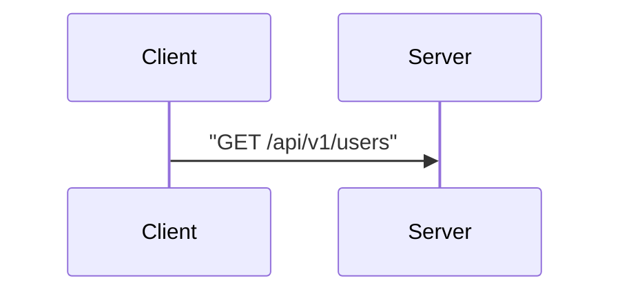
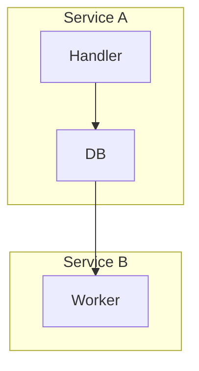
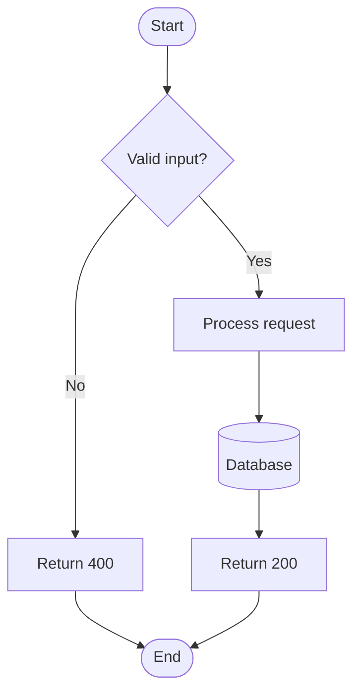
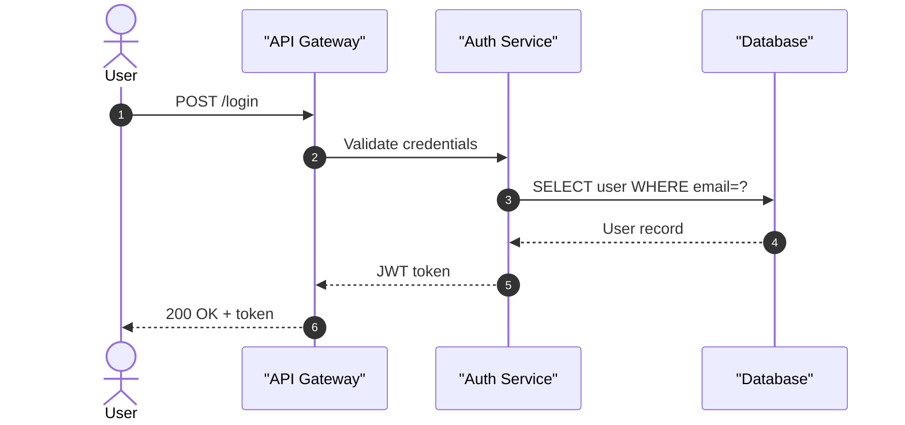
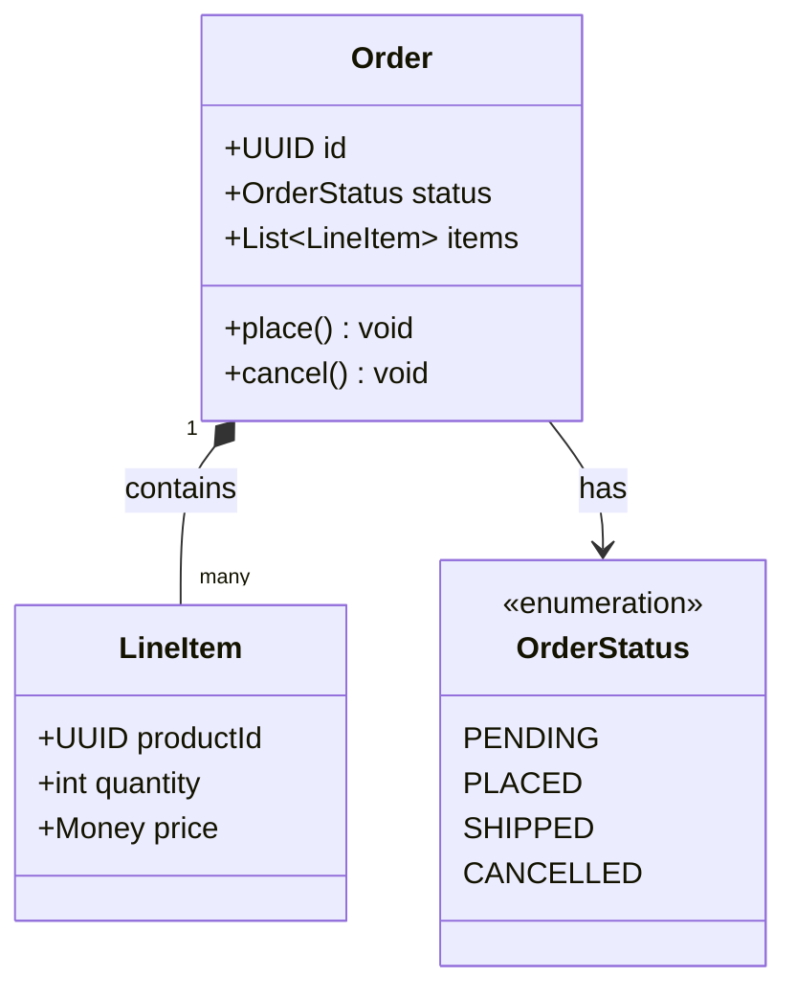
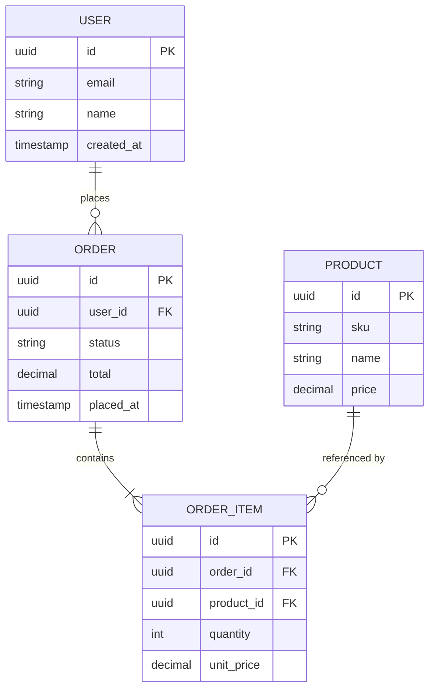
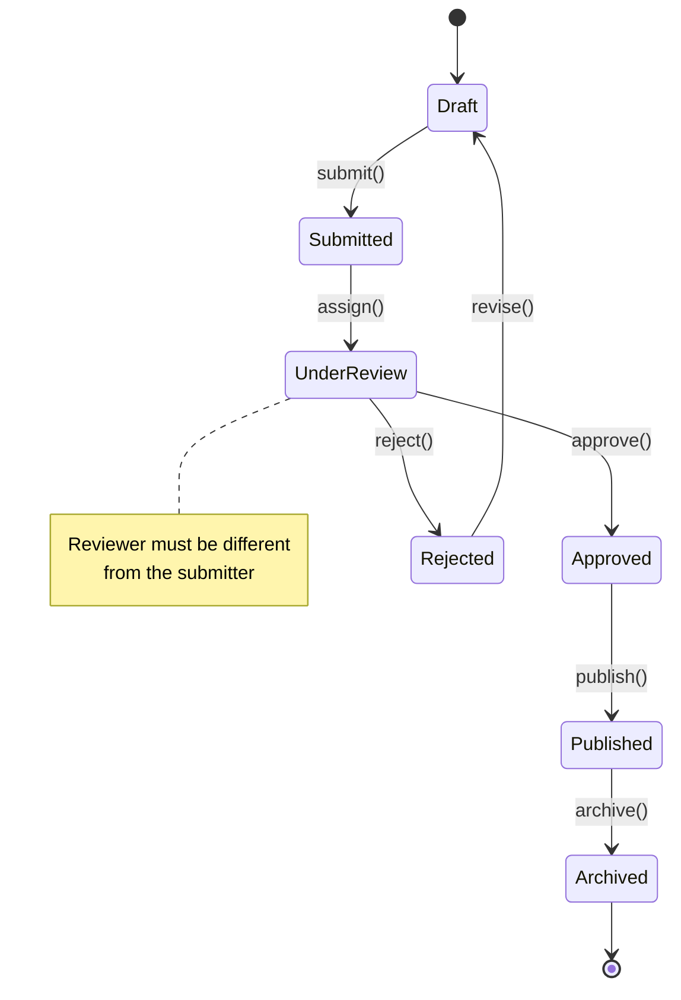
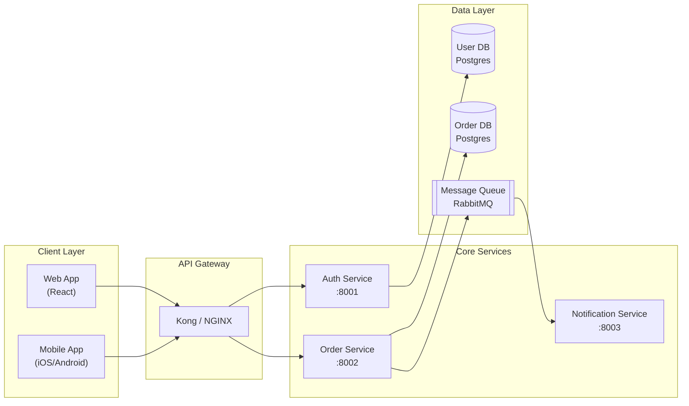

# Mermaid Diagrams in Markdown

Always output diagrams as fenced code blocks. No exceptions.

````
```mermaid
<diagram content here>
```
````

This renders natively in **GitHub**, **GitLab**, **VS Code** (with the Mermaid Preview extension), and **Obsidian**. Renderer differences: GitLab sometimes lags one Mermaid version behind GitHub; Obsidian's renderer is strict about blank lines inside blocks — avoid them.

---

## 1. Output Rules

1. **Always use the fenced block.** Never output raw Mermaid outside a code fence.
2. **Declare diagram type on line 1** inside the block (`flowchart TD`, `sequenceDiagram`, etc.).
3. **One diagram per concern.** Split large flows into multiple diagrams rather than overcrowding one.
4. **Choose direction intentionally:**
   - `TD` (top-down) — hierarchies, call stacks, approval flows
   - `LR` (left-right) — pipelines, timelines, sequential processing
   - `TB` = same as `TD`; avoid `BT`/`RL` unless inverting is genuinely clearer

---

## 2. Syntax Failure Modes (Read Before Writing)

These are the most common causes of broken renders. Fix them before committing.

### 2.1 Unescaped special characters in node labels

Any label containing `()`, `[]`, `{}`, `"`, `:`, `<`, `>`, `/`, or `#` **must** be wrapped in double quotes.

```mermaid
%% WRONG — parentheses break the parser
flowchart LR
  A[Process (v2)] --> B[Done]

%% CORRECT — quote the label
flowchart LR
  A["Process (v2)"] --> B[Done]
```

**Rule:** When in doubt, quote. Quoted labels are always safe.

### 2.2 Colons inside labels

Colons are structural in some diagram types. Always quote labels containing `:`.



### 2.3 HTML in labels — `<br>` is dangerous

Mermaid supports `<br/>` inside quoted labels for line breaks, but only in flowcharts and only in some renderers. Prefer shorter labels or subgraph grouping instead.

```mermaid
%% Risky across renderers:
A["Line one<br/>Line two"]

%% Safe alternative — just keep labels short
A["Short label"]
```

### 2.4 Reserved words as node IDs

Avoid using `end`, `graph`, `style`, `classDef`, `click`, `subgraph` as bare node IDs. Prefix them: `endNode`, `graphNode`, etc.

```mermaid
%% WRONG
flowchart TD
  start --> end

%% CORRECT
flowchart TD
  startNode --> endNode
```

### 2.5 Arrow syntax must match diagram type

| Diagram type | Correct arrow | Wrong |
|---|---|---|
| flowchart | `-->`, `---`, `-.->`, `==>` | `->` |
| sequenceDiagram | `->>`, `-->>`, `-x`, `-)` | `-->` |
| stateDiagram-v2 | `-->` | `->` |

### 2.6 Subgraph nesting

Subgraphs **must** be closed with `end`. Unclosed subgraphs silently break the whole diagram.



### 2.7 Missing diagram type declaration

Every block must start with the diagram type keyword. A block starting with a node definition will fail.

```
%% WRONG — no type keyword
A --> B

%% CORRECT
flowchart LR
  A --> B
```

---

## 3. Diagram Types & Minimal Examples

### 3.1 Flowchart — process/logic flow

Use for: business processes, decision trees, CI/CD pipelines, algorithm logic.



**Node shape cheatsheet:**
- `[Text]` rectangle
- `(Text)` rounded rectangle
- `([Text])` stadium/pill
- `{Text}` diamond (decision)
- `[(Text)]` cylinder (database)
- `((Text))` circle

### 3.2 Sequence Diagram — request/response flows

Use for: API interactions, auth flows, event-driven messaging, reactive backend sequences.



**Arrow types:**
- `->>` solid arrow (synchronous call)
- `-->>` dashed arrow (response/async)
- `-x` solid with X (failed/async fire-and-forget)
- `-)` open arrow (async message)

**Useful extras:** `activate`/`deactivate`, `loop`, `alt`/`else`/`end`, `par`/`end`, `Note over A,B: text`

### 3.3 Class Diagram — domain models & design patterns

Use for: DDD aggregates, ORM models, design patterns, SDK class hierarchies.



**Relationship arrows:**
- `<|--` inheritance
- `*--` composition
- `o--` aggregation
- `-->` association
- `..>` dependency
- `..|>` realization/implements

### 3.4 Entity-Relationship Diagram — data modeling

Use for: database schemas, API data contracts, migration planning.



**Cardinality syntax:** `||`, `o|`, `}|`, `|{`, `o{`, `}{`  — left side then right side of the relationship.

### 3.5 State Diagram — lifecycle / state machines

Use for: order lifecycle, user session states, CI/CD job states, connection states.



Always use `stateDiagram-v2`. The v1 syntax is deprecated and has fewer features.

### 3.6 Architecture / Microservices — flowchart with subgraphs

Native C4 support (`C4Context`, `C4Container`) is **not yet stable** across GitHub, GitLab, and Obsidian. Use **flowchart + subgraphs** as the reliable fallback for service architecture diagrams.



**Conventions for architecture diagrams:**
- Group by layer or bounded context using subgraphs
- Add port numbers or protocols to service labels when meaningful
- Use `[("...")]` for databases, `[["..."]]` for queues/brokers
- Prefer `LR` for pipeline-style architectures, `TD` for layered architectures
- Label edges with protocols when there are multiple: `-->|REST|`, `-->|gRPC|`, `-->|AMQP|`

---

## 4. Label Quoting Quick Reference

| Situation | Example | Quote needed? |
|---|---|---|
| Plain alphanumeric | `A[LoginService]` | No |
| Contains parentheses | `A["createUser(id)"]` | **Yes** |
| Contains colon | `A["v1: stable"]` | **Yes** |
| Contains angle brackets | `A["List<User>"]` | **Yes** |
| Contains slash | `A["GET /users"]` | **Yes** |
| Contains newline | `A["Line1\nLine2"]` | **Yes** |
| Contains `#` or `%` | `A["100%"]` | **Yes** |

---

## 5. Validation Checklist

Before committing a diagram, verify:

- [ ] Diagram type declared on line 1
- [ ] All node IDs avoid reserved words (`end`, `graph`, `style`, etc.)
- [ ] Labels with special characters are double-quoted
- [ ] Every `subgraph` has a matching `end`
- [ ] Arrow syntax matches the diagram type
- [ ] No blank lines inside the fenced block (Obsidian compat)
- [ ] Tested in at least one live renderer

**Live renderers:**
- **mermaid.live** — canonical, immediate feedback, shareable links
- **VS Code** — install "Markdown Preview Mermaid Support" extension, then open MD preview
- **GitHub** — paste into a Gist or PR description to verify
- **Obsidian** — open the note in preview mode

---

## 6. Reference Gallery

For copy-pasteable, fully-annotated examples of every diagram type above, see:

📄 **`references/diagram-gallery.md`**

Read this file when you need a more complex starting point than the minimal examples above — e.g., a sequence diagram with `alt`/`loop` blocks, a class diagram with interfaces, or a multi-bounded-context architecture.
