# Mermaid Diagram Gallery

Verified, copy-pasteable examples. Each diagram is annotated with the patterns it demonstrates.
Use these as starting templates — adapt IDs and labels to your domain.

## Table of Contents
1. [Flowcharts](#1-flowcharts)
   - 1a. Simple decision flow
   - 1b. Parallel branches + subgraphs
   - 1c. CI/CD pipeline (LR)
2. [Sequence Diagrams](#2-sequence-diagrams)
   - 2a. REST auth flow with alt block
   - 2b. Event-driven async messaging
3. [Class Diagrams](#3-class-diagrams)
   - 3a. Domain aggregate with enums
   - 3b. Repository pattern with interfaces
4. [Entity-Relationship Diagrams](#4-entity-relationship-diagrams)
   - 4a. E-commerce schema
5. [State Diagrams](#5-state-diagrams)
   - 5a. Order lifecycle
   - 5b. Connection state machine with concurrent states
6. [Architecture / Microservices](#6-architecture--microservices)
   - 6a. Three-tier web app
   - 6b. Event-driven microservices (multi-bounded-context)

---

## 1. Flowcharts

### 1a. Simple decision flow
*Demonstrates: decision diamond, multiple exit paths, terminal nodes, quoted label with parentheses*

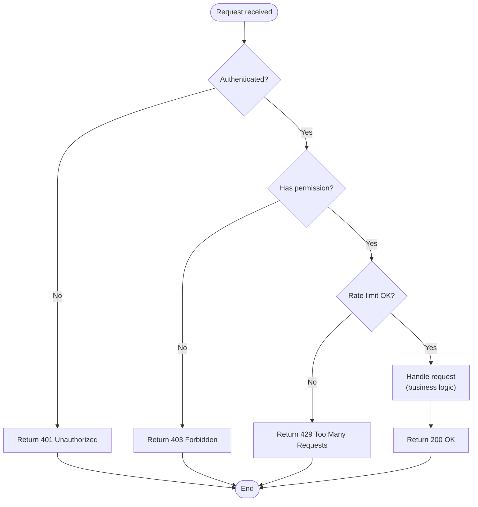

---

### 1b. Parallel branches + subgraphs
*Demonstrates: subgraphs as bounded contexts, parallel edges, database node shape, styled subgraph labels*

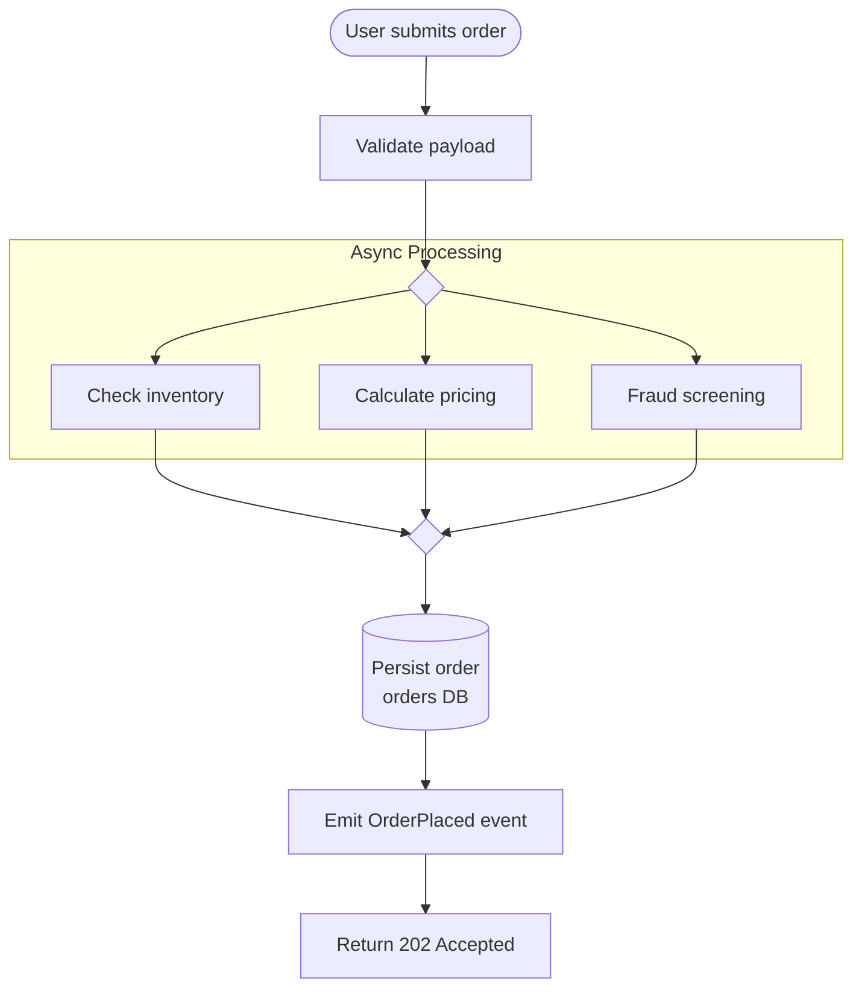

---

### 1c. CI/CD pipeline (LR)
*Demonstrates: LR direction for sequential pipelines, edge labels with protocols, stadium nodes*

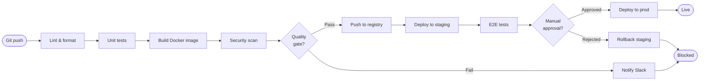

---

## 2. Sequence Diagrams

### 2a. REST auth flow with alt block
*Demonstrates: autonumber, actor vs participant, alt/else/end, activate/deactivate, note*

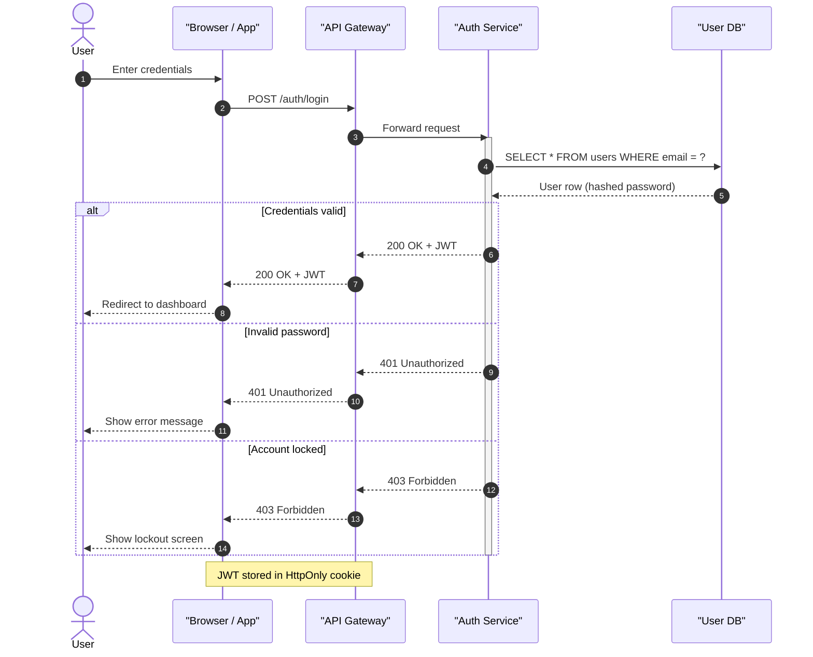

---

### 2b. Event-driven async messaging
*Demonstrates: par block for concurrent paths, -x for fire-and-forget, loop block, open arrow for async*

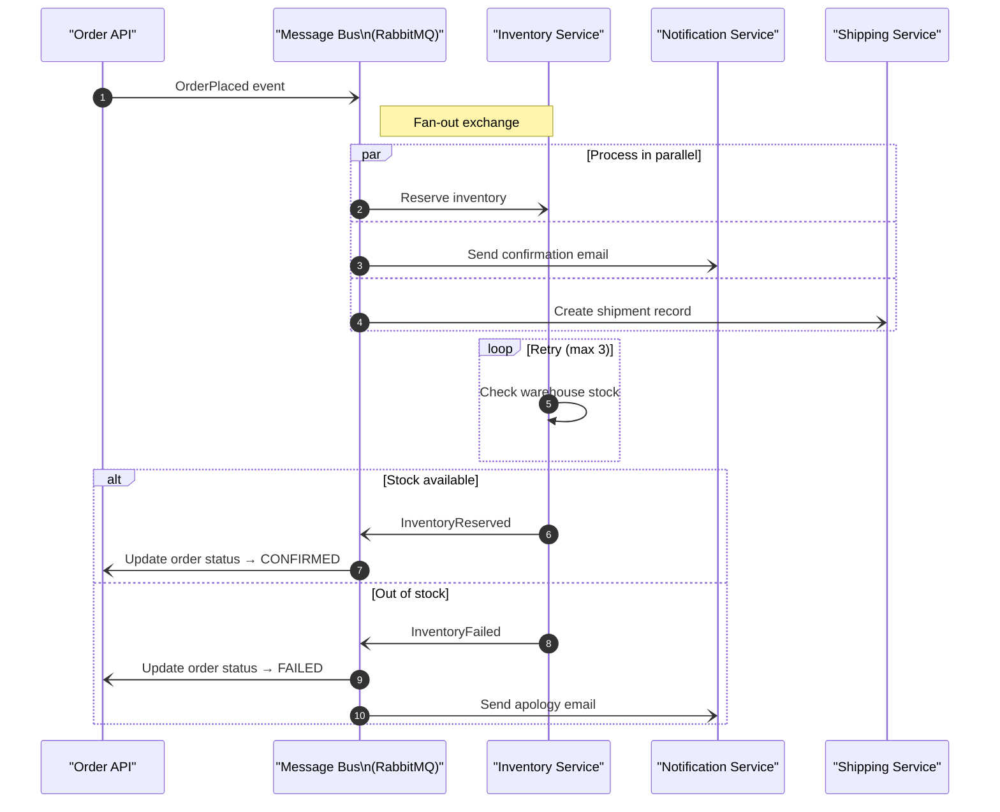

---

## 3. Class Diagrams

### 3a. Domain aggregate with enums
*Demonstrates: visibility modifiers, generic types (List~T~), enum stereotype, relationships with labels*

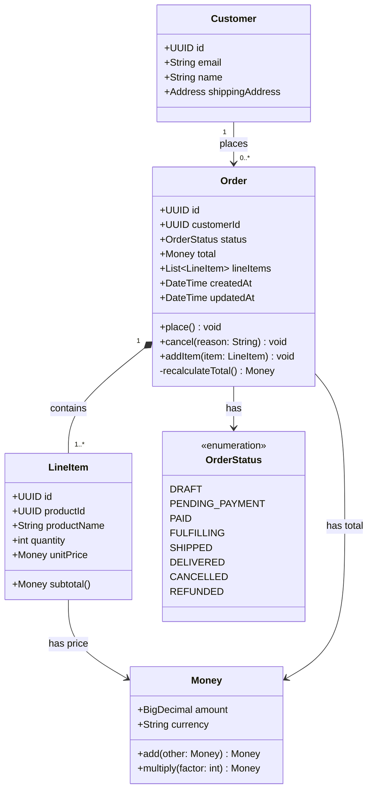

---

### 3b. Repository pattern with interfaces
*Demonstrates: interface stereotype, realization (..|>), dependency (..>), namespace grouping*

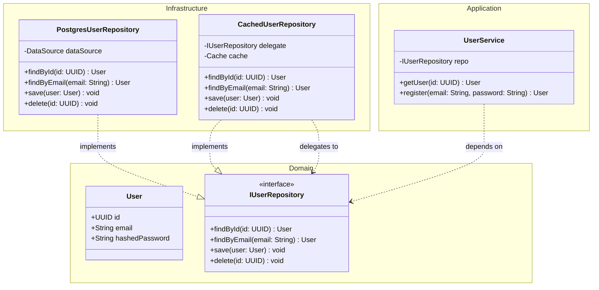

---

## 4. Entity-Relationship Diagrams

### 4a. E-commerce schema
*Demonstrates: PK/FK annotations, all cardinality variants, multi-table schema*

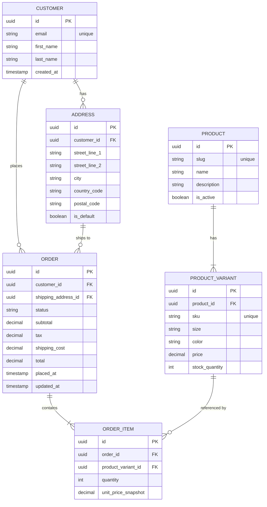

---

## 5. State Diagrams

### 5a. Order lifecycle
*Demonstrates: labeled transitions, note, descriptive guard conditions*

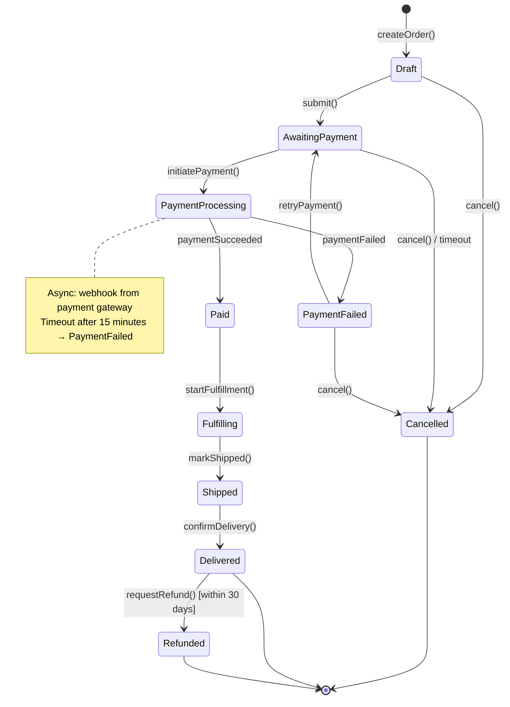

---

### 5b. Connection state machine with concurrent states
*Demonstrates: concurrent (parallel) states using -- separator*

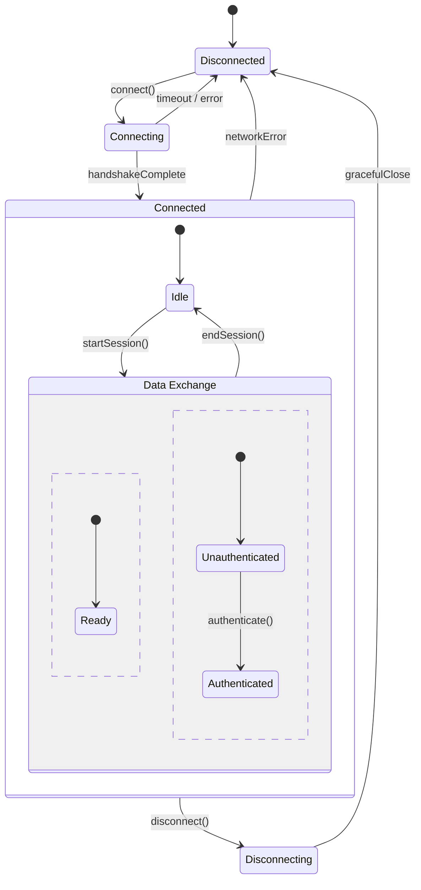

---

## 6. Architecture / Microservices

### 6a. Three-tier web app
*Demonstrates: TD layered layout, subgraph per tier, edge labels with protocols*

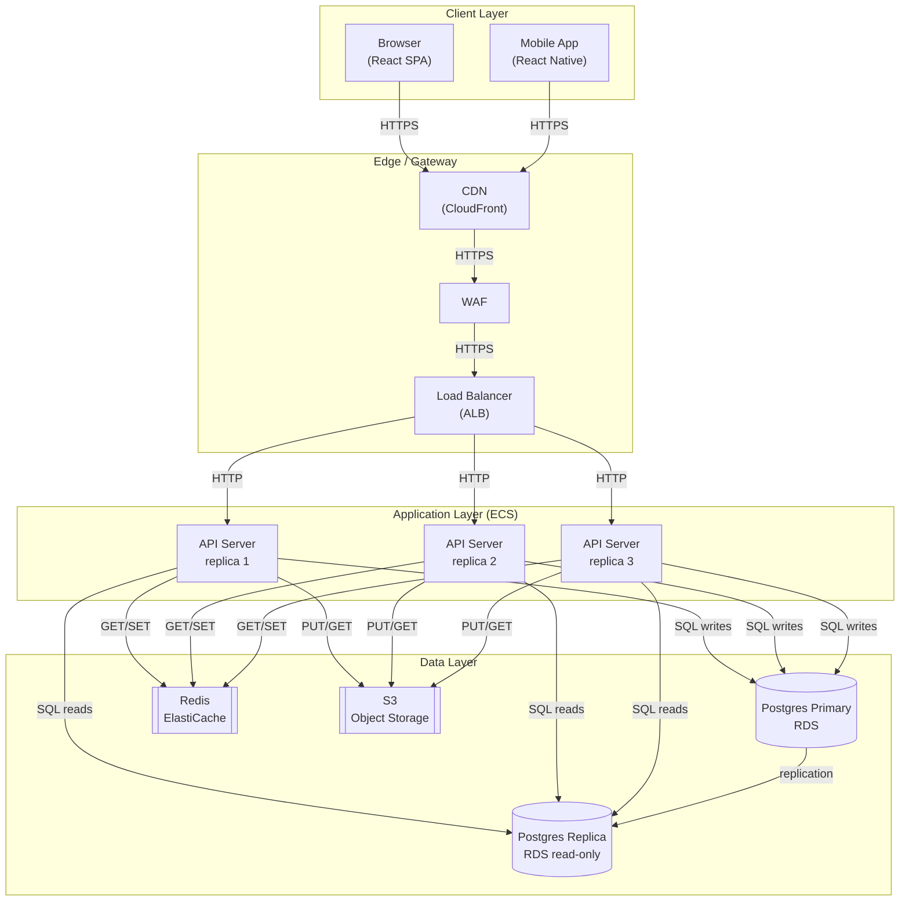

---

### 6b. Event-driven microservices (multi-bounded-context)
*Demonstrates: LR layout for event flow, multiple bounded contexts as subgraphs, message bus as central node, async vs sync edge labels*

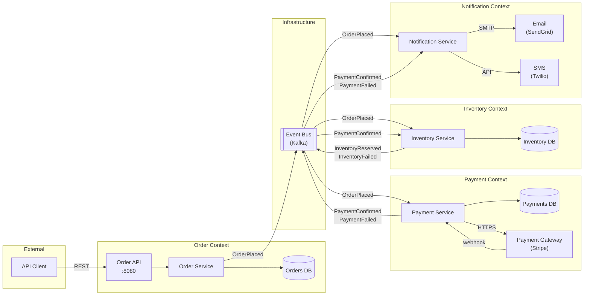

---

## Quick-Reference: Syntax Reminders

```
%% This is a comment — works in all diagram types

%% Flowchart — shapes
A[Rectangle]
B(Rounded)
C([Stadium])
D{Diamond}
E[(Database)]
F[[Queue / Subroutine]]
G((Circle))

%% Flowchart — edges
A --> B          %% arrow
A --- B          %% line, no arrow
A -->|label| B   %% labeled arrow
A -.-> B         %% dotted arrow
A ==> B          %% thick arrow
A --o B          %% circle end
A --x B          %% cross end

%% Sequence — arrow types
A->>B: sync call
A-->>B: response / async reply
A-)B: async fire-and-forget
A-xB: failed / terminated

%% Class — relationship types
A <|-- B    %% B extends A
A *-- B     %% composition
A o-- B     %% aggregation
A --> B     %% association
A ..> B     %% dependency
A ..|> B    %% B implements A
A .. B      %% link (dashed)
```
