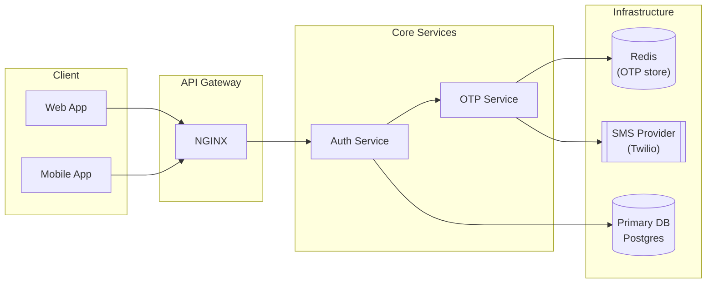
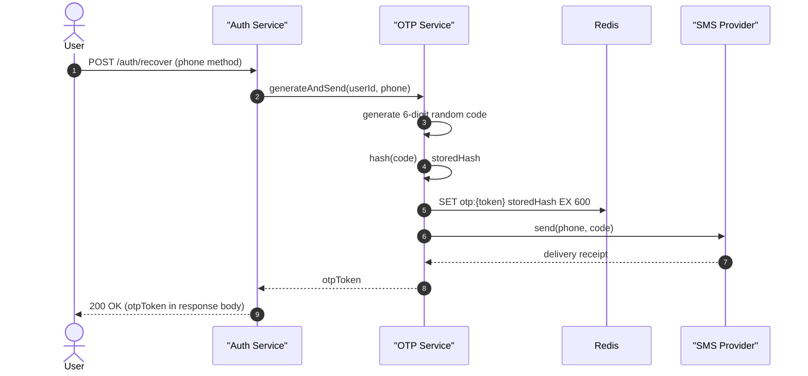
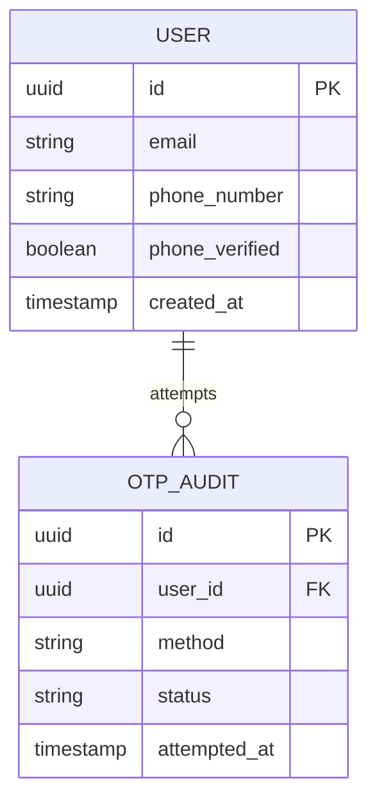
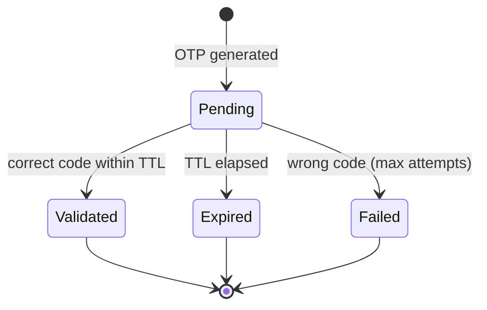

# Technical Specification: [Feature / Project Name]

> **Document metadata**
> - **ID:** SPEC-NNN
> - **Status:** Draft | In Review | Approved
> - **Author:** [Name / Role — Architect]
> - **Last updated:** YYYY-MM-DD
> - **Linked PRD:** PRD-NNN — [Feature Name]
> - **Reviewers:** [Names]

---

## 1. Overview

> *Two to five paragraphs. Describe the technical solution at the level a new team member would need to orient themselves. Cover: what is being built, the key architectural approach, and why this approach was chosen over obvious alternatives. Do not re-state the problem (that is the PRD's job) — link back to the PRD instead.*
>
> *Include the top-level architecture diagram here using the mermaid skill (flowchart + subgraphs). This is the single most important diagram in the document.*

**Example overview paragraph:**
> This spec describes the SMS-based OTP account recovery flow. The implementation adds a stateless OTP service behind the existing API gateway; the service is responsible for generation, delivery, and validation. We chose a stateless design (OTPs stored in Redis with TTL, not in the primary DB) to keep the hot-path fast and avoid schema migrations. See ADR-003 for the Redis-vs-DB decision.

**Architecture diagram** *(mermaid skill — flowchart LR or TD with subgraphs; see mermaid/SKILL.md §3.6)*:



---

## 2. Architecture

> *Narrate the diagram. Walk through each layer: why these boundaries, what crosses them, and what the key invariants are. If there are multiple meaningful flows (e.g., happy path vs. error path), add a sequence diagram per flow using the mermaid skill.*

### 2.1 Key Architectural Decisions

> *Brief prose for decisions made in this spec. For decisions that deserve long-term record, write an ADR instead and reference it here.*

- **Decision name:** [e.g., Stateless OTP store] — [rationale in one sentence]. See ADR-003.
- **Decision name:** — rationale.

### 2.2 Design Patterns Used

> *List patterns explicitly; explain why each fits. This section prevents "why did you use X?" questions in review.*

| Pattern | Applied where | Rationale |
|---|---|---|
| Repository | OTPRepository, UserRepository | Decouples service logic from storage engine; simplifies testing with fakes |
| Strategy | SMS delivery | Allows swapping providers without touching OTP logic |
| Circuit Breaker | SMS provider calls | Prevents cascade failure if provider is degraded |

---

## 3. Component / Service Breakdown

> *One subsection per component, service, or module. For each: responsibility, interface (what it exposes), dependencies (what it calls), and a sequence diagram if it owns a non-trivial flow.*

### 3.1 OTP Service

**Responsibility:** Generate, hash, store, deliver, and validate OTPs.

**Exposes:**
- `generateAndSend(userId, phoneNumber): otpToken`
- `validate(otpToken, code): boolean`

**Depends on:** Redis (TTL store), SMS provider, UserRepository (read-only).

**OTP generation flow** *(mermaid skill — sequenceDiagram; see mermaid/SKILL.md §3.2)*:



### 3.2 [Next Component]

> *Repeat the pattern above.*

---

## 4. Data Model

> *Describe every persistent entity introduced or modified by this feature. Use an ER diagram (mermaid skill) for relational schemas. Use a state diagram (mermaid skill) for any entity with a lifecycle.*

### 4.1 Entity-Relationship Diagram *(mermaid skill — erDiagram; see mermaid/SKILL.md §3.4)*



> *For Redis keys, document the key pattern, value type, and TTL in prose — Redis is not relational.*

**Redis key:** `otp:{token}` → `{ hash: string, userId: uuid }` · TTL: 600 s

### 4.2 State Diagram (if applicable) *(mermaid skill — stateDiagram-v2; see mermaid/SKILL.md §3.5)*

> *Add a state diagram for any entity whose lifecycle has multiple states and non-trivial transitions.*



### 4.3 Migrations

> *List schema changes. Reference migration file names if they exist.*

| Migration | Description |
|---|---|
| `0042_add_phone_to_users.sql` | Adds `phone_number` (nullable) and `phone_verified` (boolean, default false) to `users`. |
| `0043_create_otp_audit.sql` | Creates `otp_audit` table. |

---

## 5. API Contracts

> *One subsection per endpoint or event introduced or modified. Include: HTTP method + path (or event name), request schema, response schema, and error codes. Use a sequence diagram if the endpoint orchestrates multiple services.*

### 5.1 POST /auth/recover

**Purpose:** Initiate account recovery.  
**Auth:** None (pre-authentication).

**Request:**
```json
{
  "method": "sms",
  "email": "user@example.com"
}
```

**Response 200:**
```json
{
  "otp_token": "uuid-v4"
}
```

**Errors:**

| Code | Condition |
|---|---|
| 400 | Missing or invalid `method` |
| 404 | No account found for `email` |
| 422 | No verified phone number on file |
| 429 | Rate limit exceeded |

### 5.2 POST /auth/recover/verify

**Purpose:** Submit OTP code to complete recovery.  
**Auth:** None (pre-authentication).

**Request:**
```json
{
  "otp_token": "uuid-v4",
  "code": "123456"
}
```

**Response 200:**
```json
{
  "session_token": "jwt..."
}
```

**Errors:**

| Code | Condition |
|---|---|
| 400 | Malformed request |
| 401 | Invalid or expired OTP |

---

## 6. Cross-Cutting Concerns

### 6.1 Authentication & Authorisation

> *How does auth work for new endpoints? What tokens are issued, what scopes are granted, what changes to existing auth middleware?*

### 6.2 Error Handling

> *Error taxonomy: expected errors (return structured JSON with `error_code`), unexpected errors (log + return 500, never leak internals). Define the error envelope schema used across all endpoints.*

```json
{ "error_code": "RATE_LIMIT_EXCEEDED", "message": "Too many OTP requests. Try again in 42 minutes." }
```

### 6.3 Observability

> *What is instrumented? Define the key metrics, log events, and traces.*

| Signal | Name | When |
|---|---|---|
| Counter | `otp.generated.total` | Every OTP generated |
| Counter | `otp.validated.success` / `.failure` | Every validation attempt |
| Histogram | `otp.delivery.latency_ms` | Per SMS send |
| Log event | `otp_audit` (structured) | Success, failure, expiry |

### 6.4 Security Considerations

> *Threat model summary for this feature. Cover: what attacker actions are in scope, what mitigations exist, what is explicitly out of scope.*

### 6.5 Rollout & Feature Flags

> *How will this be deployed? Dark launch, flag-gated, canary? What is the rollback plan?*

---

## 7. Requirements Traceability

> *This is the architect's formal acknowledgement of the BA's requirements. Every FR and NFR from the linked PRD must appear here with a status. Do not omit or renumber IDs.*

| Requirement ID | Description (abbreviated) | Status | Notes / Where addressed |
|---|---|---|---|
| FR-001 | SMS recovery initiation | ✅ Satisfied | §3.1 OTP Service, §5.1 API |
| FR-002 | Cryptographic OTP generation | ✅ Satisfied | §3.1 generation flow |
| FR-003 | OTP expiry and one-time use | ✅ Satisfied | §4 Redis TTL + used flag |
| FR-004 | Resend rate limiting | ✅ Satisfied | §5.1 429 handling, §6.1 |
| FR-005 | Audit logging | ✅ Satisfied | §6.3 otp_audit log event |
| FR-006 | User phone number update | ⚠️ Deferred | Out of scope for this spec; tracked in backlog |
| NFR-001 | OTP delivery < 5 s p95 | ✅ Satisfied | §6.3 latency histogram + SLA in §6.4 |
| NFR-002 | OTP hashing | ✅ Satisfied | §3.1 — bcrypt before Redis write |
| NFR-003 | Provider SLA ≥ 99.5% | ✅ Satisfied | Twilio chosen per ADR-003 |
| NFR-004 | Data-protection compliance | ✅ Satisfied | §6.4 security — no PII in logs |
| NFR-005 | WCAG 2.1 AA | ⚠️ Partial | UI not in this spec; flagged for frontend spec |

> **Status legend:** ✅ Satisfied · ⚠️ Partial / deferred · ❌ Not satisfied (requires discussion)

---

## Appendix: Open Questions

| # | Question | Owner | Status |
|---|---|---|---|
| 1 | Redis cluster or single instance? | Architect | Open |
| 2 | Should OTP audit rows be purged after N days? | BA + Architect | Open |
