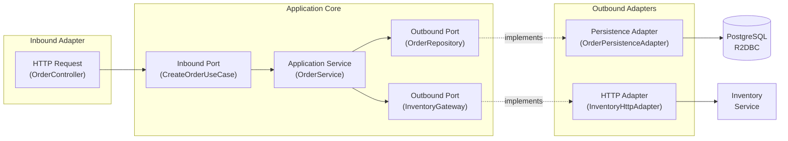

# Feature Slice Reference — End-to-End Canonical Example

This file shows a complete vertical slice for a `CreateOrder` feature, wiring every layer together.
Use it as the copy-paste template when scaffolding a new feature.

---

## Table of Contents
1. [Domain Model](#1-domain-model)
2. [Application — Inbound Port (Use Case)](#2-application--inbound-port)
3. [Application — Outbound Ports](#3-application--outbound-ports)
4. [Application — Service](#4-application--service)
5. [Adapter — Inbound Web](#5-adapter--inbound-web)
6. [Adapter — Outbound Persistence (R2DBC)](#6-adapter--outbound-persistence-r2dbc)
7. [Adapter — Outbound HTTP Client](#7-adapter--outbound-http-client)
8. [Configuration / Wiring](#8-configuration--wiring)
9. [Hexagonal Layout Diagram (Mermaid)](#9-hexagonal-layout-diagram)

---

## 1. Domain Model

```java
// domain/model/OrderId.java
public record OrderId(String value) {
    public OrderId {
        Objects.requireNonNull(value, "OrderId must not be null");
        if (value.isBlank()) throw new IllegalArgumentException("OrderId must not be blank");
    }
}

// domain/model/CustomerId.java
public record CustomerId(String value) {}

// domain/model/OrderItem.java
public record OrderItem(String productId, int quantity, BigDecimal unitPrice) {}

// domain/model/OrderStatus.java
public enum OrderStatus { PENDING, CONFIRMED, CANCELLED }

// domain/model/Order.java
public record Order(
    OrderId id,
    CustomerId customerId,
    List<OrderItem> items,
    OrderStatus status,
    Instant createdAt
) {
    public static Order newOrder(CustomerId customerId, List<OrderItem> items) {
        return new Order(
            new OrderId(UUID.randomUUID().toString()),
            customerId,
            List.copyOf(items),
            OrderStatus.PENDING,
            Instant.now()
        );
    }

    public BigDecimal total() {
        return items.stream()
            .map(i -> i.unitPrice().multiply(BigDecimal.valueOf(i.quantity())))
            .reduce(BigDecimal.ZERO, BigDecimal::add);
    }
}

// domain/exception/OrderNotFoundException.java
public class OrderNotFoundException extends DomainException {
    public OrderNotFoundException(OrderId id) {
        super("Order not found: " + id.value());
    }
}

// domain/exception/InsufficientInventoryException.java
public class InsufficientInventoryException extends DomainException {
    public InsufficientInventoryException(String productId) {
        super("Insufficient inventory for product: " + productId);
    }
}

// domain/exception/DomainException.java
public abstract class DomainException extends RuntimeException {
    protected DomainException(String message) { super(message); }
    protected DomainException(String message, Throwable cause) { super(message, cause); }
}
```

---

## 2. Application — Inbound Port

```java
// application/port/in/CreateOrderUseCase.java
public interface CreateOrderUseCase {
    Mono<Order> createOrder(CreateOrderCommand command);
}

// application/port/in/GetOrderUseCase.java
public interface GetOrderUseCase {
    Mono<Order> getOrder(OrderId id);
}

// application/port/in/CreateOrderCommand.java
// Commands are simple data carriers — no framework deps, can live in port/in or domain/model
public record CreateOrderCommand(CustomerId customerId, List<OrderItem> items) {}
```

---

## 3. Application — Outbound Ports

```java
// application/port/out/OrderRepository.java
public interface OrderRepository {
    Mono<Order> findById(OrderId id);
    Mono<Order> save(Order order);
    Flux<Order> findByCustomerId(CustomerId customerId);
}

// application/port/out/InventoryGateway.java
public interface InventoryGateway {
    Mono<Boolean> checkAvailability(String productId, int quantity);
    Mono<Void> reserve(String productId, int quantity);
}
```

---

## 4. Application — Service

```java
// application/service/OrderService.java
@Service
@RequiredArgsConstructor
@Slf4j
public class OrderService implements CreateOrderUseCase, GetOrderUseCase {

    private final OrderRepository orderRepository;
    private final InventoryGateway inventoryGateway;

    @Override
    public Mono<Order> createOrder(CreateOrderCommand command) {
        return validateInventory(command.items())          // check all items
            .then(Mono.defer(() -> {
                var order = Order.newOrder(command.customerId(), command.items());
                return orderRepository.save(order);
            }))
            .doOnSuccess(order -> log.info("Order created: {}", order.id().value()));
    }

    @Override
    public Mono<Order> getOrder(OrderId id) {
        return orderRepository.findById(id)
            .switchIfEmpty(Mono.error(new OrderNotFoundException(id)));
    }

    private Mono<Void> validateInventory(List<OrderItem> items) {
        return Flux.fromIterable(items)
            .flatMap(item -> inventoryGateway.checkAvailability(item.productId(), item.quantity())
                .filter(Boolean.TRUE::equals)
                .switchIfEmpty(Mono.error(new InsufficientInventoryException(item.productId()))))
            .then();
    }
}
```

---

## 5. Adapter — Inbound Web

```java
// adapter/in/web/CreateOrderRequest.java
public record CreateOrderRequest(
    @NotBlank String customerId,
    @NotEmpty @Valid List<OrderItemRequest> items
) {
    public CreateOrderCommand toCommand() {
        return new CreateOrderCommand(
            new CustomerId(customerId),
            items.stream().map(OrderItemRequest::toItem).toList()
        );
    }
}

// adapter/in/web/OrderItemRequest.java
public record OrderItemRequest(
    @NotBlank String productId,
    @Min(1) int quantity,
    @NotNull @DecimalMin("0.01") BigDecimal unitPrice
) {
    public OrderItem toItem() {
        return new OrderItem(productId, quantity, unitPrice);
    }
}

// adapter/in/web/OrderResponse.java
public record OrderResponse(
    String id,
    String customerId,
    List<OrderItemResponse> items,
    String status,
    BigDecimal total,
    String createdAt
) {
    public static OrderResponse from(Order order) {
        return new OrderResponse(
            order.id().value(),
            order.customerId().value(),
            order.items().stream().map(OrderItemResponse::from).toList(),
            order.status().name(),
            order.total(),
            order.createdAt().toString()
        );
    }
}

// adapter/in/web/OrderItemResponse.java
public record OrderItemResponse(String productId, int quantity, BigDecimal unitPrice) {
    public static OrderItemResponse from(OrderItem item) {
        return new OrderItemResponse(item.productId(), item.quantity(), item.unitPrice());
    }
}

// adapter/in/web/OrderController.java
@RestController
@RequestMapping("/orders")
@RequiredArgsConstructor
@Slf4j
public class OrderController {

    private final CreateOrderUseCase createOrderUseCase;
    private final GetOrderUseCase getOrderUseCase;

    @PostMapping
    @ResponseStatus(HttpStatus.CREATED)
    public Mono<OrderResponse> createOrder(@RequestBody @Valid Mono<CreateOrderRequest> body) {
        return body
            .map(CreateOrderRequest::toCommand)
            .flatMap(createOrderUseCase::createOrder)
            .map(OrderResponse::from);
    }

    @GetMapping("/{id}")
    public Mono<ResponseEntity<OrderResponse>> getOrder(@PathVariable String id) {
        return getOrderUseCase.getOrder(new OrderId(id))
            .map(OrderResponse::from)
            .map(ResponseEntity::ok);
    }
}

// adapter/in/web/GlobalExceptionHandler.java — see error-model.md for full version
@RestControllerAdvice
public class GlobalExceptionHandler {
    // See references/error-model.md
}
```

---

## 6. Adapter — Outbound Persistence (R2DBC)

```java
// adapter/out/persistence/OrderEntity.java
@Table("orders")
public record OrderEntity(
    @Id String id,
    String customerId,
    String status,
    BigDecimal total,
    Instant createdAt
) {}

// adapter/out/persistence/OrderItemEntity.java
@Table("order_items")
public record OrderItemEntity(
    @Id Long id,         // surrogate key
    String orderId,      // FK
    String productId,
    int quantity,
    BigDecimal unitPrice
) {}

// adapter/out/persistence/SpringDataOrderRepository.java
// Internal — never referenced outside this package
interface SpringDataOrderRepository extends ReactiveCrudRepository<OrderEntity, String> {}

// adapter/out/persistence/SpringDataOrderItemRepository.java
interface SpringDataOrderItemRepository extends ReactiveCrudRepository<OrderItemEntity, Long> {
    Flux<OrderItemEntity> findByOrderId(String orderId);
}

// adapter/out/persistence/OrderPersistenceMapper.java
@Component
public class OrderPersistenceMapper {

    public Mono<Order> toDomain(OrderEntity entity, List<OrderItemEntity> itemEntities) {
        var items = itemEntities.stream()
            .map(i -> new OrderItem(i.productId(), i.quantity(), i.unitPrice()))
            .toList();
        return Mono.just(new Order(
            new OrderId(entity.id()),
            new CustomerId(entity.customerId()),
            items,
            OrderStatus.valueOf(entity.status()),
            entity.createdAt()
        ));
    }

    public OrderEntity toEntity(Order order) {
        return new OrderEntity(
            order.id().value(),
            order.customerId().value(),
            order.status().name(),
            order.total(),
            order.createdAt()
        );
    }

    public List<OrderItemEntity> toItemEntities(Order order) {
        return order.items().stream()
            .map(item -> new OrderItemEntity(
                null, order.id().value(), item.productId(), item.quantity(), item.unitPrice()))
            .toList();
    }
}

// adapter/out/persistence/OrderPersistenceAdapter.java
@Component
@RequiredArgsConstructor
@Transactional
public class OrderPersistenceAdapter implements OrderRepository {

    private final SpringDataOrderRepository orderRepo;
    private final SpringDataOrderItemRepository itemRepo;
    private final OrderPersistenceMapper mapper;

    @Override
    public Mono<Order> findById(OrderId id) {
        return orderRepo.findById(id.value())
            .zipWhen(entity -> itemRepo.findByOrderId(entity.id()).collectList())
            .flatMap(tuple -> mapper.toDomain(tuple.getT1(), tuple.getT2()));
    }

    @Override
    public Mono<Order> save(Order order) {
        return orderRepo.save(mapper.toEntity(order))
            .flatMap(saved -> Flux.fromIterable(mapper.toItemEntities(order))
                .flatMap(itemRepo::save)
                .then(Mono.just(order)));
    }

    @Override
    public Flux<Order> findByCustomerId(CustomerId customerId) {
        // Simplified — load items per order with flatMap
        return orderRepo.findAll()
            .filter(e -> e.customerId().equals(customerId.value()))
            .flatMap(entity -> itemRepo.findByOrderId(entity.id()).collectList()
                .flatMap(items -> mapper.toDomain(entity, items)));
    }
}
```

---

## 7. Adapter — Outbound HTTP Client

```java
// adapter/out/client/InventoryHttpAdapter.java
@Component
@RequiredArgsConstructor
@Slf4j
public class InventoryHttpAdapter implements InventoryGateway {

    private final WebClient inventoryClient;  // configured in AppConfig

    @Override
    public Mono<Boolean> checkAvailability(String productId, int quantity) {
        return inventoryClient.get()
            .uri("/inventory/{productId}/availability?quantity={qty}", productId, quantity)
            .retrieve()
            .bodyToMono(AvailabilityResponse.class)
            .map(AvailabilityResponse::available)
            .onErrorMap(WebClientResponseException.class,
                ex -> new ExternalServiceException("Inventory check failed", ex))
            .onErrorMap(WebClientException.class,
                ex -> new ExternalServiceException("Inventory service unreachable", ex));
    }

    @Override
    public Mono<Void> reserve(String productId, int quantity) {
        return inventoryClient.post()
            .uri("/inventory/{productId}/reserve", productId)
            .bodyValue(new ReserveRequest(quantity))
            .retrieve()
            .bodyToMono(Void.class)
            .onErrorMap(WebClientResponseException.class,
                ex -> new ExternalServiceException("Inventory reservation failed", ex));
    }

    private record AvailabilityResponse(boolean available) {}
    private record ReserveRequest(int quantity) {}
}
```

---

## 8. Configuration / Wiring

```java
// adapter/config/AppConfig.java
@Configuration
public class AppConfig {

    @Bean
    public WebClient inventoryClient(AppProperties props) {
        return WebClient.builder()
            .baseUrl(props.inventoryServiceUrl())
            .codecs(c -> c.defaultCodecs().maxInMemorySize(1 * 1024 * 1024))
            .defaultHeader(HttpHeaders.CONTENT_TYPE, MediaType.APPLICATION_JSON_VALUE)
            .build();
    }
}

// adapter/config/AppProperties.java
@ConfigurationProperties(prefix = "app")
@Validated
public record AppProperties(
    @NotBlank String inventoryServiceUrl,
    @NotNull Duration httpTimeout
) {}

// Main application class — stays in root package
@SpringBootApplication
@EnableConfigurationProperties(AppProperties.class)
public class OrderApplication {
    public static void main(String[] args) {
        SpringApplication.run(OrderApplication.class, args);
    }
}
```

`application.yml` (minimal):
```yaml
app:
  inventory-service-url: http://inventory-service
  http-timeout: 5s

spring:
  r2dbc:
    url: r2dbc:postgresql://localhost:5432/orders
    username: ${DB_USER}
    password: ${DB_PASS}
```

---

## 9. Hexagonal Layout Diagram

> Use the **mermaid** skill to render this. Below is the source for a component diagram showing
> the hexagonal structure of this slice.

````

````
